#  DGX Model Manager

A single-file web UI for managing AI models and inference engines on **NVIDIA DGX Spark** and compatible aarch64 GPU systems. Pull Ollama models, browse HuggingFace, manage your local model inventory, route through LiteLLM, and control five inference engines — all from one browser tab.

    

---

## What It Does

DGX Model Manager is a **lightweight control panel** for AI infrastructure. It doesn't serve models itself — it orchestrates the services that do.

| Capability | Details |
|-----------|---------|
| **Ollama Management** | Pull, list, and delete models with live download progress |
| **LiteLLM Routing** | One-click wildcard routing so every Ollama model is auto-exposed to all apps |
| **5 Inference Engines** | Start/stop SGLang, vLLM, llama.cpp, LocalAI, and ComfyUI via configurable profiles |
| **Model Inventory** | Unified view of all local models — HF cache, custom directories, Ollama — with format/task/source filtering |
| **HuggingFace Browser** | Search HF Hub, discover quantized variants, preview files, one-click download |
| **HuggingFace Download** | Stream any model from HF Hub to local cache with resume support |
| **Live Status Bar** | Real-time health indicators for all 7 services |
| **Logs & Diagnostics** | System overview, app logs, engine logs, LiteLLM journalctl, Docker state — all in-browser |
| **Settings & Security** | Configurable service URLs, optional API key authentication, connectivity testing |
| **Built-in Documentation** | Full user manual at `/help` |

---

## Stack Architecture

```
Your Apps (Open WebUI, agents, scripts, any OpenAI-compatible client)
         |
         v
   LiteLLM :4000  ──────────────────┬────────────┬──────────────┐
         |                          |            |              |
         v                          v            v              v
  SGLang :30000               Ollama :11434   vLLM :8000    llama.cpp :8080
  (large models)              (small/medium,  (alternative   (GGUF models)
                               hot-swap)       engine)

  Also managed:  LocalAI :9090 (multi-modal)  |  ComfyUI :8188 (image gen UI)

  Model Manager :8090  <-- this app (sits alongside, never in request path)
```

The Model Manager talks directly to each service's API and to Docker for container lifecycle. It never proxies inference requests.

---

## Requirements

| Component | Required | Notes |
|-----------|----------|-------|
| Python 3.10+ | Yes | Pre-installed on DGX Spark |
| [Ollama](https://ollama.com) | Yes | Core model management |
| Docker | Recommended | Required for engine start/stop (SGLang, vLLM, LocalAI, ComfyUI) |
| [LiteLLM](https://github.com/BerriAI/litellm) | Optional | Unified API routing |
| [SGLang](https://github.com/sgl-project/sglang) | Optional | High-performance inference |
| [vLLM](https://github.com/vllm-project/vllm) | Optional | Alternative inference engine |
| [llama.cpp](https://github.com/ggerganov/llama.cpp) | Optional | GGUF model inference |
| [LocalAI](https://github.com/mudler/LocalAI) | Optional | Multi-modal AI (LLM+TTS+STT+image gen) |
| [ComfyUI](https://github.com/comfyanonymous/ComfyUI) | Optional | Image generation workflows |

The app works with just Ollama installed. Every other service tab gracefully shows offline status when its service isn't running.

---

## Quick Start

```bash
# 1. Clone the repo
git clone https://github.com/calico88x/DGX-Model-Manager.git
cd DGX-Model-Manager

# 2. Create your config from the example
cp config.example.json config.json
nano config.json

# 3. Run the interactive setup
bash setup.sh

# 4. Open in your browser
#    http://<your-device-ip>:8090
```

The setup script handles:
- Python virtual environment creation
- Dependency installation (`fastapi`, `uvicorn`, `httpx`, `pyyaml`, `huggingface_hub`)
- Engine script directories (`~/SGLang/`, `~/vLLM/`, `~/llama.cpp/`, `~/LocalAI/`, `~/ComfyUI/`) with example profiles
- UFW firewall rule (optional)
- Passwordless sudo for LiteLLM restart (optional)
- systemd service installation (optional)

---

## Configuration

Copy `config.example.json` to `config.json` and edit as needed. The repo ships with the example — `config.json` itself is gitignored so your runtime settings (including hashed API keys) don't dirty the working tree or get pushed upstream. Every field has a sensible default.

```json
{
  "app": {
    "host": "0.0.0.0",
    "port": 8090
  },
  "services": {
    "ollama_base":   "http://127.0.0.1:11434",
    "litellm_base":  "http://127.0.0.1:4000",
    "sglang_base":   "http://127.0.0.1:30000",
    "vllm_base":     "http://127.0.0.1:8000",
    "llamacpp_base": "http://127.0.0.1:8080",
    "localai_base":  "http://127.0.0.1:9090",
    "comfyui_base":  "http://127.0.0.1:8188"
  },
  "paths": {
    "litellm_config": "~/litellm/litellm_config.yaml",
    "hf_cache":       "~/.cache/huggingface/hub"
  }
}
```

Service URLs can also be changed at runtime via the **Settings** tab in the UI. Changes are written back to `config.json`.

---

## Ollama

Pull models with live progress bars, view installed models with size and quantization details, and delete models you no longer need.

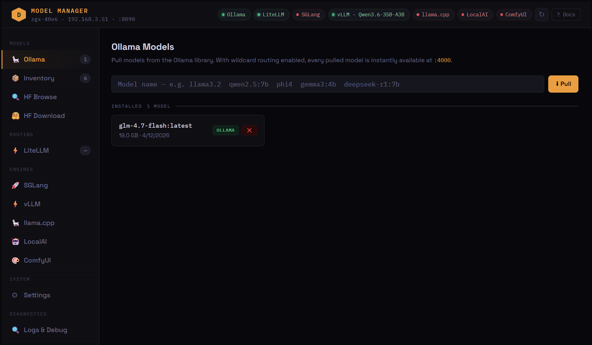

---

## LiteLLM Routing

The **Apply Wildcard** button adds a single entry to your `litellm_config.yaml`:

```yaml
- model_name: ollama/*
  litellm_params:
    model: ollama/*
    api_base: http://127.0.0.1:11434
```

After this one-time change, every model you pull into Ollama is automatically available to all apps connected to LiteLLM at `:4000` — no further config edits required. LiteLLM restarts automatically.

> The wildcard covers Ollama models only. SGLang, vLLM, and other engines need explicit entries in the LiteLLM config.

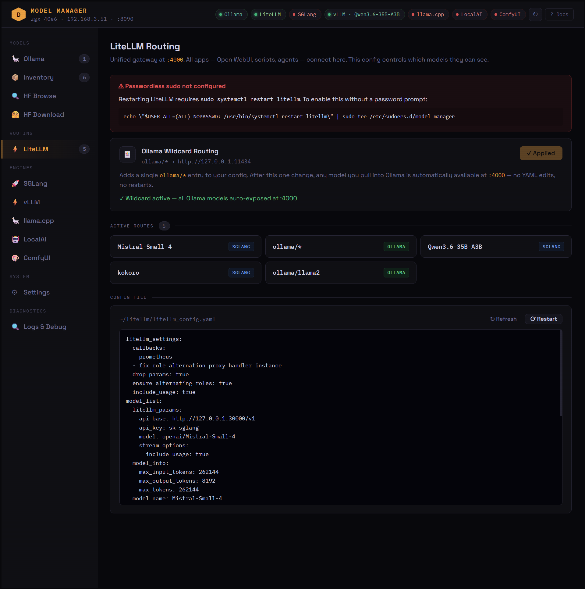

---

## Inference Engines

All five engines (SGLang, vLLM, llama.cpp, LocalAI, ComfyUI) share the same profile system. Place shell scripts in the engine's directory and they're automatically discovered:

| Engine | Script Directory | Default Port |
|--------|-----------------|-------------|
| SGLang | `~/SGLang/start_*.sh` | 30000 |
| vLLM | `~/vLLM/start_*.sh` | 8000 |
| llama.cpp | `~/llama.cpp/start_*.sh` | 8080 |
| LocalAI | `~/LocalAI/start_*.sh` | 9090 |
| ComfyUI | `~/ComfyUI/start_*.sh` | 8188 |

### Creating a Profile

1. Create a script named `start_*.sh` in the engine's directory
2. Add optional header comments to control the profile card display
3. The profile appears in the UI immediately — no restart needed

```bash
#!/usr/bin/env bash
# Name: My Model
# Description: Brief description of this profile
# VRAM: 48

sudo docker run --rm --gpus all --ipc=host \
  --name my-sglang-container \
  -v ~/.cache/huggingface:/root/.cache/huggingface \
  -p 30000:30000 \
  lmsysorg/sglang:latest \
  python3 -m sglang.launch_server \
    --model-path /root/.cache/huggingface/hub/models--owner--model/snapshots/main \
    --host 0.0.0.0 \
    --port 30000
```

The three header fields (`# Name:`, `# Description:`, `# VRAM:`) are optional. Without them, the name is derived from the filename and VRAM shows as `--`.

### SGLang

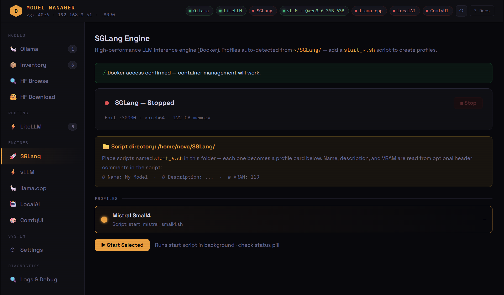

### vLLM

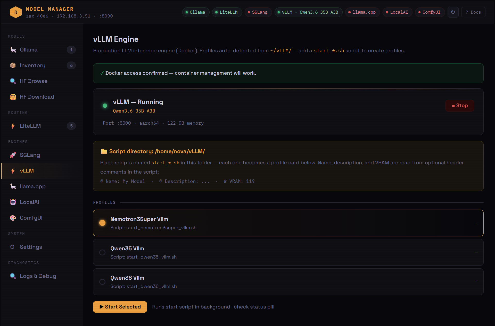

### llama.cpp

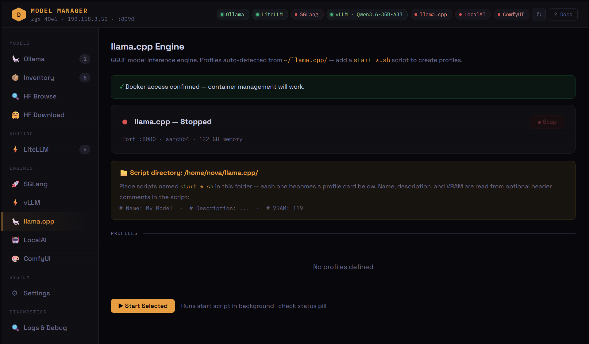

### LocalAI

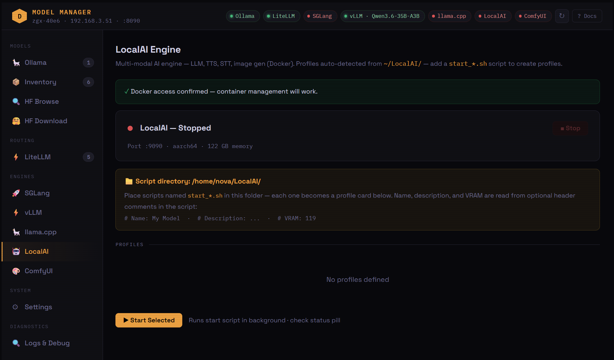

### ComfyUI

ComfyUI has its own web UI — when running, an "Open UI" button appears linking directly to the ComfyUI interface.

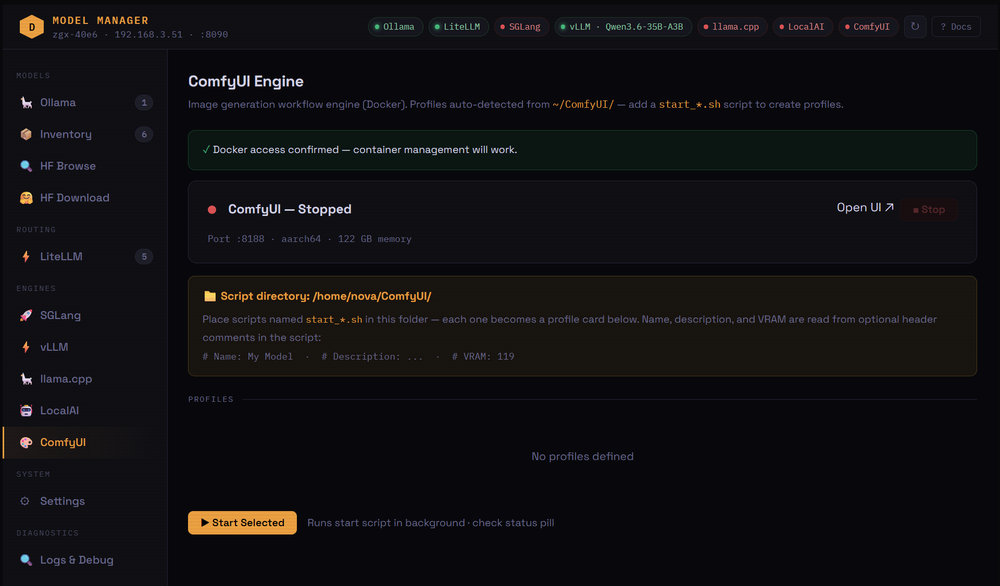

### SGLang vs vLLM

Both engines are excellent choices for large model inference:

| | SGLang | vLLM |
|---|---|---|
| **Strengths** | RadixAttention (prefix caching), fast structured output, strong MoE support | Broad model/quantization support, PagedAttention, mature ecosystem |
| **Docker image** | `lmsysorg/sglang:*` | `vllm/vllm-openai:*` |
| **Default port** | 30000 | 8000 |
| **API format** | OpenAI-compatible (`/v1/`) | OpenAI-compatible (`/v1/`) |

Both expose the same OpenAI-compatible API, so your apps don't need to change when switching between them.

---

## Model Inventory

Unified view of every model on your device across HuggingFace cache, custom directories, and Ollama. Search, filter by source/format/task, sort by name/size/parameters, and enrich with HuggingFace metadata.

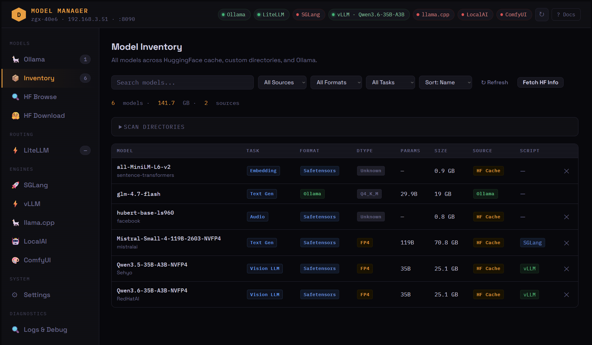

---

## HuggingFace Browser

Search HuggingFace Hub without leaving the app. Filter by pipeline type, sort by downloads/likes/trending. Result cards show task badges, download counts, and format tags. Expand any result to see its file list with sizes and discover quantized variants (GGUF, GPTQ, AWQ). One-click download pre-fills the HF Download tab.

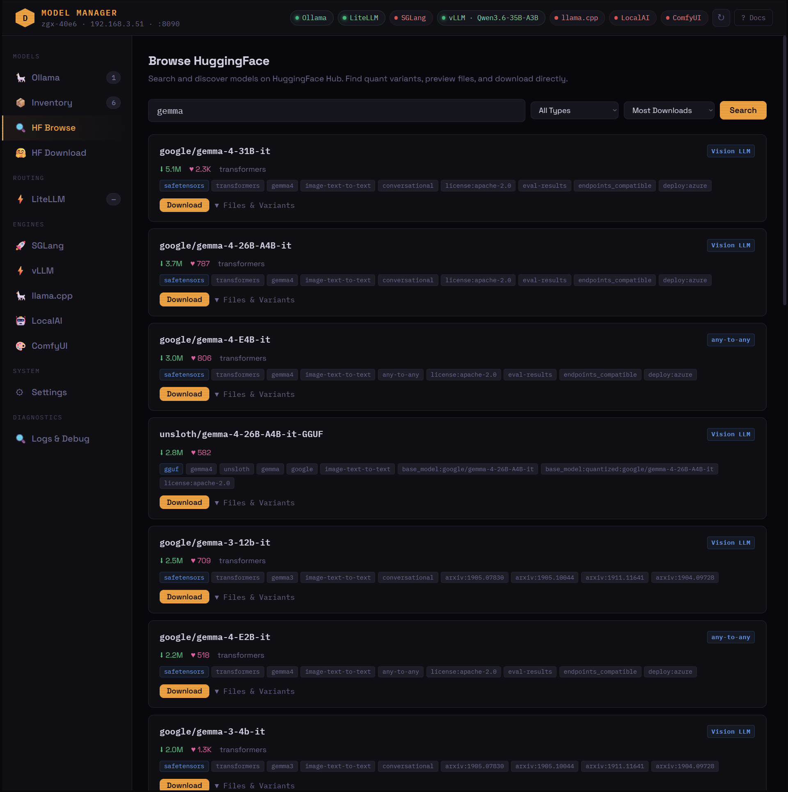

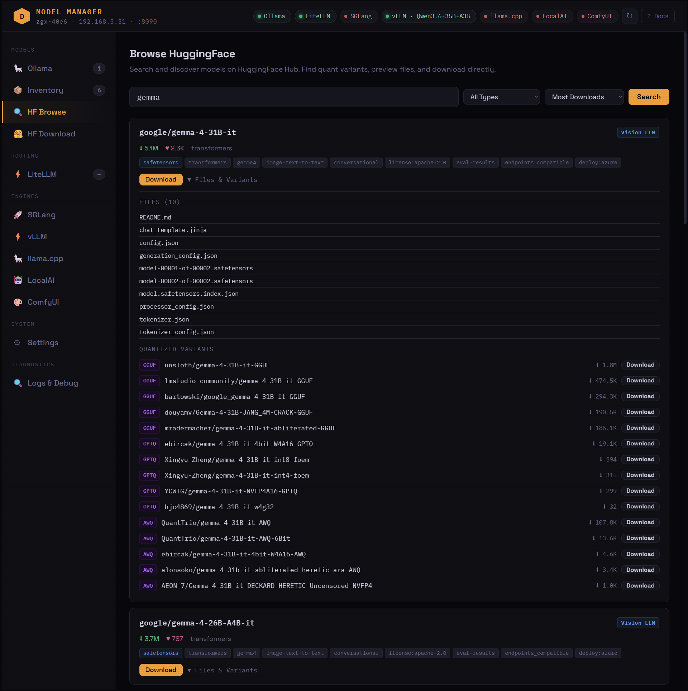

---

## HuggingFace Download

Stream any model from HuggingFace Hub to your local cache with real-time progress and resume support. Downloads to the default HF cache by default. To download to a custom directory, register it first under **Inventory → Scan Directories**.

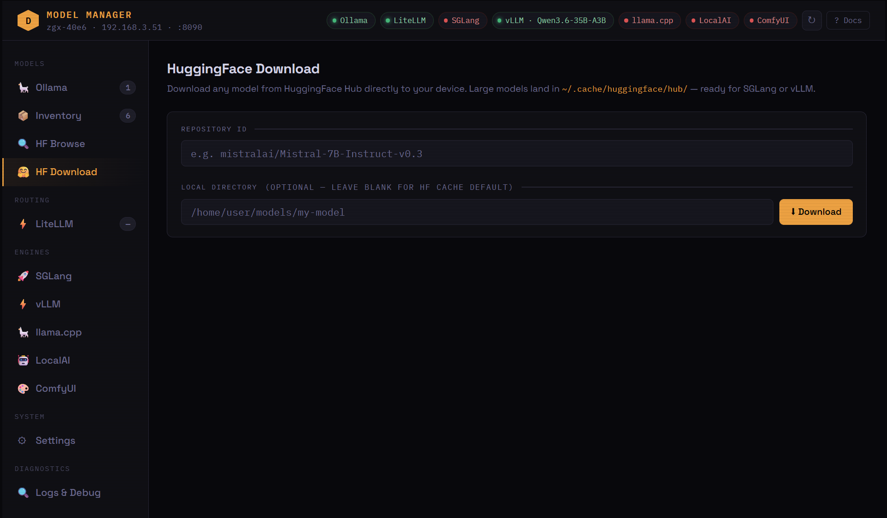

---

## Settings

Centralized configuration for all 7 service URLs and API key management. One-click connectivity testing for every service.

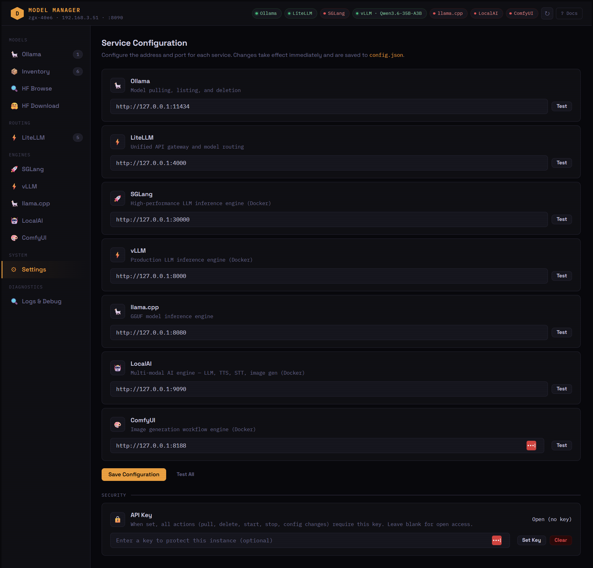

---

## Security

API key authentication is **optional** and can be enabled from the Settings tab.

- When set, all mutating operations and sensitive read endpoints require the key via `Authorization: Bearer <key>`
- Basic status, inventory, and profile endpoints remain accessible without auth
- The key is stored in `config.json` as a SHA-256 hash — the plaintext is never written to disk
- Verification uses constant-time `hmac.compare_digest()` to prevent timing attacks
- Legacy plaintext keys from older versions are auto-upgraded to hashes on first load
- If the app starts bound to a non-loopback address with no key set, it emits a warning to the systemd journal and waits 10 seconds before accepting connections. Set `MODEL_MANAGER_ALLOW_UNAUTH=1` to suppress this.

---

## Logs & Diagnostics

Full-stack visibility into your AI infrastructure — system overview, running configuration, color-coded application logs, per-engine log files, LiteLLM journalctl, and live Docker container state.

| Section | What It Shows |
|---------|--------------|
| System Overview | Hostname, IP, architecture, memory, Python version, uptime, disk usage, service health with latency |
| Running Config | App configuration, LiteLLM YAML, all engine profiles |
| Application Logs | Color-coded ring buffer (500 entries) with level/search filters and auto-refresh |
| Engine Logs | Latest log files from `/tmp/` for each engine |
| LiteLLM Logs | journalctl output for the LiteLLM service |
| Docker Containers | Live container state table |

Application logs are in-memory only (no disk writes). The buffer clears on app restart.

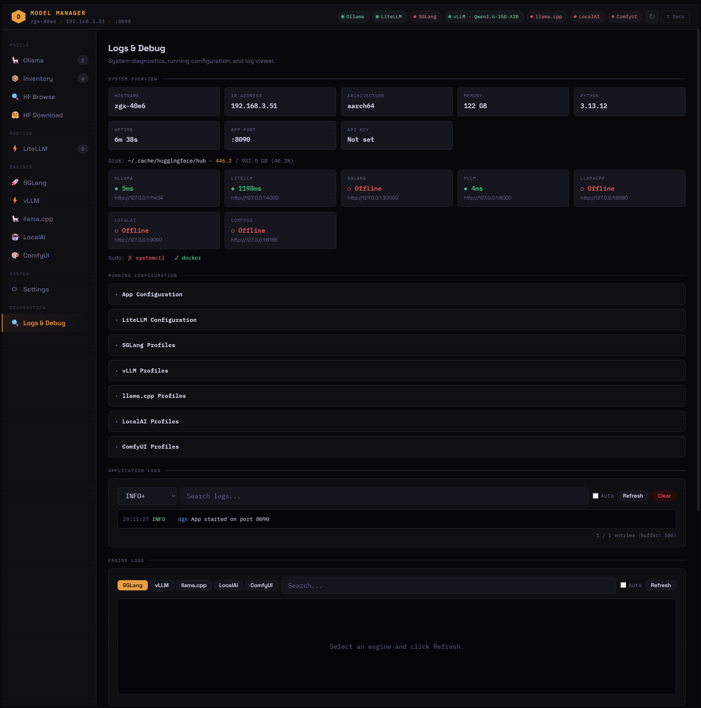

---

## Built-in Documentation

Full user manual served at `/help` covering every feature, the profile system, security setup, and troubleshooting.

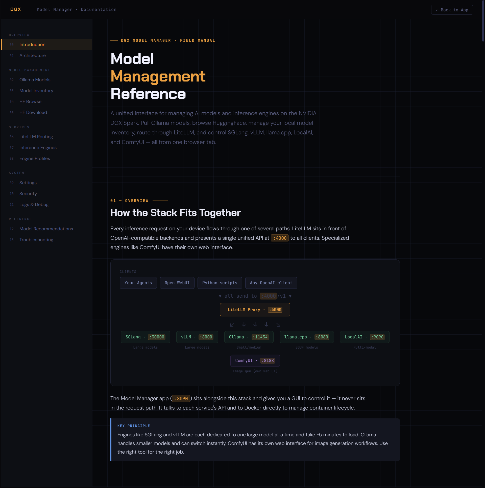

---

## Running Without systemd

```bash
# Activate the venv and run directly
source venv/bin/activate
python3 app.py

# Or with uvicorn for hot reload
venv/bin/uvicorn app:app --host 0.0.0.0 --port 8090 --reload
```

---

## Service Management

```bash
# Status
sudo systemctl status model-manager

# Restart
sudo systemctl restart model-manager

# Logs
sudo journalctl -u model-manager -f

# Disable autostart
sudo systemctl disable model-manager
```

---

## Project Structure

```
DGX-Model-Manager/
  app.py              # The entire application (~4,500 lines)
  config.example.json # Default config — copy to config.json
  config.json         # Your runtime config (gitignored)
  requirements.txt    # Python dependencies
  setup.sh            # Interactive setup script
  docs.html           # Built-in documentation (served at /help)
  favicon.png         # App icon
  misc/               # Screenshots
  CHANGELOG.md        # Release history
  .gitignore          # Excludes config.json, venv/, runtime data
```

The app is a **single Python file** by design. All HTML, CSS, and JavaScript are inline. Config is resolved relative to `app.py`'s directory, so it works no matter where you clone the repo.

---

## Testing

```bash
pip install -r requirements-dev.txt
python3 -m pytest -q
```

The suite in `tests/` covers the highest-consequence logic: profile script parsing (`# VRAM:` headers), model metadata inference, the unified-memory admission check that gates engine launches, and alert collection/routing with cooldown persistence. External I/O (Docker, HTTP health checks, `/proc/meminfo`) is mocked — tests never touch running services.

---

## API Reference

All endpoints are under `/api/`. Basic status and inventory endpoints are unauthenticated. Mutating and diagnostic endpoints require the API key when auth is enabled.

<details>
<summary>Click to expand endpoint list</summary>

| Method | Endpoint | Auth | Description |
|--------|----------|------|-------------|
| GET | `/api/status` | No | Aggregated health for all services |
| GET | `/api/nodeinfo` | No | Hostname, IP, ports, service URLs |
| GET | `/api/config` | No | Current configuration |
| PUT | `/api/config` | Yes | Update configuration |
| GET | `/api/ollama/models` | No | List installed Ollama models |
| POST | `/api/ollama/pull` | Yes | Pull an Ollama model (streaming) |
| DELETE | `/api/ollama/models/{name}` | Yes | Delete an Ollama model |
| GET | `/api/litellm/models` | No | Active LiteLLM routes |
| GET | `/api/litellm/config` | Yes | LiteLLM config file |
| POST | `/api/litellm/apply-wildcard` | Yes | Apply wildcard routing |
| POST | `/api/litellm/restart` | Yes | Restart LiteLLM service |
| GET | `/api/{engine}/profiles` | No | List engine profiles |
| GET | `/api/{engine}/status` | No | Engine health + running model |
| POST | `/api/{engine}/start` | Yes | Start engine with profile |
| POST | `/api/{engine}/stop` | Yes | Stop engine container |
| GET | `/api/inventory` | No | Unified model inventory |
| GET | `/api/hf/search` | No | Search HuggingFace Hub |
| POST | `/api/hf/download` | Yes | Download from HF Hub (streaming) |
| GET | `/api/hf/inventory/dirs` | No | List custom scan directories |
| POST | `/api/hf/inventory/dirs` | Yes | Add a custom directory |
| DELETE | `/api/hf/inventory/dirs` | Yes | Remove a custom directory |
| POST | `/api/hf/inventory/delete` | Yes | Delete a model from disk |
| GET | `/api/debug/system` | Yes | System diagnostics |
| GET | `/api/debug/config` | Yes | Running configuration |
| GET | `/api/debug/docker` | Yes | Docker container state |
| GET | `/api/logs/app` | Yes | Application log buffer |
| DELETE | `/api/logs/app` | Yes | Clear log buffer |
| GET | `/api/logs/engine/{engine}` | Yes | Engine log files |
| GET | `/api/logs/litellm` | Yes | LiteLLM journalctl output |

`{engine}` is one of: `sglang`, `vllm`, `llamacpp`, `localai`, `comfyui`

</details>

---

## License

MIT
